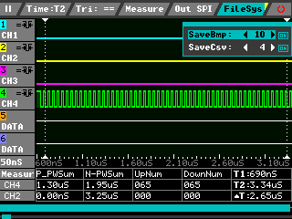

# The Bela Code
## Makefile
* [here line #L282-L288](https://github.com/giuliomoro/Bela-private-dhruva/blob/multi-codec/Makefile#L282-L288): ``BELA_USE_DEFINE`` is used as a argument to the CPP Code [here](https://github.com/giuliomoro/Bela-private-dhruva/blob/multi-codec/Makefile#L290) for ``DEFAULT_COMMON_FLAGS``.
My idea: We can pass the BBAI flag by `BELA_USE_DEFINE += BBAIFLAG` in the argument. So accordingly whenever it compiles any codes it will automatically pass on the bbai flag to detect the board. Also once the board arrives only will I be able to test if the BBAI overlay export stuff works or not. Depending on that only I will add that instructions to the makefile.
One more thing: I will need the McASP code to work for BBAI and backwards as well. This is where the board detection will be really useful.
So for now let's add the lines to the makefile that just detect the bbai and keep it's flag ready. 

* [line #L451-L459](https://github.com/giuliomoro/Bela-private-dhruva/blob/bbai-makefile/Makefile#L451-L459): **Rule for Bela core ASM files** 
* [line #L461-L476](https://github.com/giuliomoro/Bela-private-dhruva/blob/bbai-makefile/Makefile#L461-L476): **PRU asm part** ``pasm -V2 -L -c -b "$<"``. 

As discussed, I have to made the following changes here:
use the _clpru toolchain_.

Also, add the disasm prudis to makefile as follows: ``prudis file.bin | sed 's/^\(.*\)$/" \1\\n"/' > included_assembly.h``

## Asm files

**pru_rtaudio.p**
- If I replace the older addresses with the one’s for BBAi, will that not break BBB compatibility? How can we tackle this issue? <br>
_soln:_ you can use #ifdef to make them conditional at compile time. The Makefile could detect whether we are running on an AM335x or an AM572x and define a flag accordingly. This same flag can be used for conditional compilation of the libprussdrv vs rproc stuff in core/PRU.cpp. This could be the initial approach because it’s faster to get it done. Later in the project, we could move to a runtime flag if appropriate by passing a flag to the PRU at runtime for whether we are on am335x or am527x
and allow it to select the relevant addresses at runtime. [source](https://forum.beagleboard.org/t/bela-support-for-bbai-later-ti-chips/29257/6)

- We are using only MCASP1 on the BBAI, so you don’t really need MCASP2. Also, the define for MCASP1 on the AM335x is not needed, because we never use that. <br>
The MCSPI and GPIO addresses will also need to change between the two boards.
The following Table compares the Hex addresses of these pins.

The freq of McASP CLK is, as seen from the Logic Analyzer measurement below, 20MHz


## CPP Files

**core/PRU.cpp**
Code for communicating with the Programmable Realtime Unit (PRU)
on the BeagleBone AM335x series processors. The PRU loads and runs
a separate code image compiled from an assembly file. Here it is
used to handle audio and SPI ADC/DAC data.
This code is specific to the PRU code in the assembly file; for example,
it uses certain GPIO resources that correspond to that image. <br> 
It uses the following libprussdrv functions currently: ([ref1: Ti_AM33XX_PRUSSv2](https://elinux.org/Ti_AM33XX_PRUSSv2#Host_to_PRU_.28ARM_Cortex-A8_to_PRU.29), [prussdrv.h](https://github.com/beagleboard/am335x_pru_package/blob/master/pru_sw/app_loader/include/prussdrv.h), [prussdrv.c](https://github.com/beagleboard/am335x_pru_package/blob/master/pru_sw/app_loader/interface/prussdrv.c), [examples](https://github.com/beagleboard/am335x_pru_package/tree/master/pru_sw/example_apps) ) 
1. ``prussdrv_map_prumem()     // Line 101``: under `PruManagerUio::map_pru_mem(unsigned int pru_ram_id, char** address)`  
2. ``prussdrv_init()           // Line 443`` to initialize the PRU and
3. ``prussdrv_open()          // Line 444`` are now called using `PruManagerUio::start()`
4. ``prussdrv_exec_code(int prunum, const unsigned int *code, int codelen)     // Line 864`` and
5. ``prussdrv_exec_program()  // Line 874`` which is to execute any example on PRU0 where first argument is the `PRU#` and second is the `assembly` to execute. These both are now called using `PruManager run` (probably, not fixed yet)
6. ``prussdrv_pru_disable()   // Line 1686``    replaced with `PruManagerUio::stop()`.
7. ``prussdrv_exit()          // Line 1694 ``   is now called in the destructor of PruManagerUIO.

### RProc Implementation in Bela
* ``PruManager.h`` is the header file (currently under development on branch _PRUManager_) which includes the following classes:
    - ``PruManager``: which should expose parameters for the relevant paths.
    - ``PruManagerRprocMmap : public PruManager``: would use rproc for start/stop and mmap for memory sharing 
    - ``PruManagerUio : public PruManager``: is basically a wrapper for libprussdrv for both start/stop and memory sharing,
    - ``PruManagerAi : public PruManagerRprocMmap ``: probably inherit from class ``PruManagerRproc`` and set the appropriate paths

* I will also be adding a `verbose` flag to hide/show my ``cout`` statements. A similar implementation already exists in [I2cCode.cpp](https://github.com/giuliomoro/Bela-dhruva/blob/multi-codec/core/I2c_Codec.cpp#L30). If you are wondering what the commas are, they are just C++ Initialization Lists. **The Initializer List** is used to initialize data members of a class. For further explanation with an example, kindly refer [C++ Initialization Lists](https://en.cppreference.com/w/cpp/language/constructor).
>  `, i(i)` initializes X::i to the value of the parameter i

* on BBB:
    - initial state
    - create a ``PruManager`` abstract class interface (i.e.: with all the methods virtual ... = 0 )
    - implement the ``PruManagerUio`` class with the _libprussdrv_ calls currently present in the codebase
    - replace said calls and any data currently stored with a PruManagerUio object
    - at this point the code is functionally identical to the initial state but it is easier to expand upon because it is more modular
    - After this, I will implement the ``PruManagerRprocMmap`` class.
    - all of the above can be in two files:  ``include/PruManager.h`` file and  `core/PruManager.cpp` file (I'll need to add the build/`core/PruManager.o`  object  to `CORE_CORE_OBJS` for `libbela` to work as expected)

Here is the rough structure as discussed with mentor:
(Please refer the actual repo for latest status)
```C
void* PruManagerRprocMmap::getOwnMemory()
{
       return ownMemory.map(addr, 0x2000);  // addr is full address of the start of the PRU's RAM 
}
void* PruManagerRprocMmap::getSharedMemory()
{
       return sharedMemory.map(addr2, 0x3000);  // addr2 is the address of the start of PRUSS Shared RAM
}
void* PruManagerUio::getOwnMemory()
{
       void* pruDataRam;
       int ret = prussdrv_map_prumem (pru_num == 0 ? PRUSS0_PRU0_DATARAM : PRUSS0_PRU1_DATARAM, (void**)&pruDataRam);
       if(ret)
             return NULL;
       else
             return pruDataRam;
}
void* PruManagerUio::getSharedMemory()
{
       void* pruSharedRam;
       int ret = prussdrv_map_prumem (PRUSS0_SHARED_DATARAM, (void **)&pruSharedRam);
       if(ret)
            return NULL;
       else
            return pruSharedRam;
}
```

**GPIO.cpp**

The general-purpose interface combines four general-purpose input/output (GPIO) modules. Each GPIO
module provides 32 dedicated general-purpose pins with input and output capabilities; thus, the general-
purpose interface supports up to 128 (4 × 32) pins. These pins can be configured for the following
applications:
• Data input (capture)/output (drive)
• Keyboard interface with a debounce cell
• Interrupt generation in active mode upon the detection of external events. Detected events are
processed by two parallel independent interrupt-generation submodules to support biprocessor
operations.
• Wake-up request generation in idle mode upon the detection of external events.

- Refer [Gpio.cpp](https://github.com/giuliomoro/Bela-dhruva/blob/multi-codec/core/Gpio.cpp#L36-L37):

```c
bank = num / 32
bit = num % 32
```
So,
if one is to apply the formula it would be like for eg.
`GPIO 125` which is  Bela button on `P9_27`
_GPIO bank_ = `(int)125/32`  = __GPIO3__
_bit_ = `125%32` = `29`

### RPROC
(**I could not really find a suitable rproc header file and hence did not use the functions as they have been described in this section as such. Please refer section RPROC Implementation for the actual implementation in Bela** )
Before we start discussing the cpp files, let's have a brief overview of the User API of rproc, and we will mainly go through the functions specific to our application. ([ref1: rproc](https://www.kernel.org/doc/html/latest/staging/remoteproc.html), [ref2: rpmsg](https://www.kernel.org/doc/html/latest/staging/rpmsg.html), [ref3: linux docs](https://docs.huihoo.com/doxygen/linux/kernel/3.7/remoteproc_8h.html))

