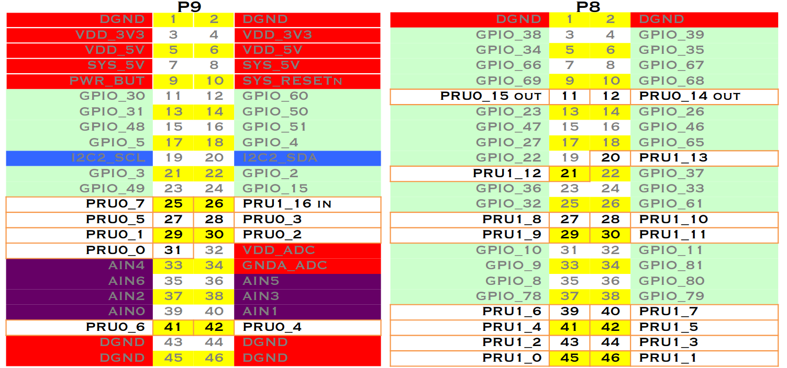

# General Overview of BeagleBoards
Before we dive into the world of [BeagleBoard](https://beagleboard.org/), we need to get a few jargon and basic concepts out of our way first!


Let's have a look at _when_ one should consider using the Beagle Boards. <br>
The Beagle boards are perfectly placed for the integration of high-level software and low-level electronics in any type of project. <br>
The major advantage over more traditional embedded systems, such as the Arduino, PIC, and AVR microcontrollers, is apparent when you leverage the Linux OS for your projects. For example, if you built a home automation system using the BeagleBone and you then decided that you wanted to make certain information available on the internet, you could simply install a web server.


## Setting up the BeagleBone

The BeagleBone Black was one of the first ever BeagleBoards I have had, and it was a bit of a hassle for me to set it up initially. Few things to keep in mind here.
1. I was using _Linux Mint 20.1 x86_64 , DE: Cinnamon_. For some reason, wired network connections were not working for me, neither ethernet nor USB. I had to serially get into the BBB to see if it was actually working atall. I then switched to dual booted Ubuntu DDE wherein I was easily able to open the cloud-9 IDE and then went on to ssh into it via the terminal.
2. The next challenge I found was that I was unable to actually boot it up from the external SD card. I was following the standard procedure: Power off board > Put in SD Card > Hold the USR button > Power on board > Flashing should start and take maximum upto 45 minutes. however, this lead to no luck as the board was still booting from the EMMC. Afterwards, my mentor helped me with finding [this link](https://learn.bela.io/using-bela/about-bela/troubleshooting-guide/#problems-booting-bela-from-the-sd-card) following which I erased the boot partition of onboard emmc and forced boot from external SD card. This worked fine and the board booted up from the BELA Image that I had flashed on the SD card.
3. Next, I realized the reason why eMMC wasn't being flashed by the SD card, it was because I had missed a small step, where one has to edit the ``/boot/uEnv.txt`` file and uncomment the last line. After doing that, I was finally able to flash the eMMC with the latest debian image.
4. I was also looking out for how I could utilize the entire space on my 32 GB SD Card, as bu default it was only using about 4 GB. So I followd these steps from [here](https://elinux.org/Beagleboard:Expanding_File_System_Partition_On_A_microSD):
    1. Follow most of the steps as it says, make sure you are **booted from the SD Card** and __not__ on board EMMC.
    2. One thing you may be asked is:

```
    Created a new partition 1 of type 'Linux' and of size 29.7 GiB.
    Partition #1 contains a ext4 signature.
    Do you want to remove the signature? [Y]es/[N]o:N

```
  Where you have to type in N and press enter. 

  3. reboot after everything is done.
  4. Now don't forget ``resize2fs /dev//mmcblk0p1`` as root and you'll get a similar output:

```
    resize2fs 1.43.4 (31-Jan-2017)
    Filesystem at /dev//mmcblk0p1 is mounted on /; on-line resizing required
    old_desc_blocks = 1, new_desc_blocks = 4
    The filesystem on /dev//mmcblk0p1 is now 7790720 (4k) blocks long.

```
  5. now you will see that you will be using the full SD card storage.

## Backup
Inorder to take a backup of your entire SD card, run the command:
```sh
sudo dd if=/dev/sdd of=backup.img bs=1M count=4096 status=progress
```
where,
- if= is the location of your sd card (type lsblk and u shall know)
- of= is the output file which will be the backup on your PC
- bs= is block size, suggest keeping it as 1M only
- count= is the size u want your bkp image to be, it is in MB
- status= shows you the live status

## PRU

Refer the image below to see the IO pins to the PRU in the BeagleBone black (taken from [here](https://beagleboard.org/static/presentations/MakerFaireNY20140920_UsingBeagleBoneRealTimeMicrocontrollers.pdf) ) <br>
 <br>
[ref1: Rebuilding PRU Firmwares on Target Using Sitara Processors](https://training.ti.com/rebuilding-pru-firmwares-target-using-sitara-processors?context=519066-1138864-1134151)
The most basic example is given on the homepage where you can learn how to simple start or stop the PRU. Here, we will look at some basic examples in C which can be downloaded from `git clone git://git.ti.com/pru-software-support-package/pru-software-support-package.git`. Let's look at how to run the most basic example that echos whatever we send to the PRU back to us.

```sh
# Make sure that you are su
$ sudo -i   # Enter the passwd: temppwd
$ cd /home/debian/pru-software-support-package/examples/am572x/PRU_RPMsg_Echo_Interrupt1_0  # Navigate to the example
$ export PRU_CGT=/usr/share/ti/cgt-pru
$ ln -s /usr/bin/ /usr/share/ti/cgt-pru/bin # Create a symbolic link
$ vim main.c
```
First change the following lines:
```c
#define CHAN_DESC                       "Channel 39"
#define CHAN_PORT                       39
```
and then, go to line#101 and inside the while loop write:
```c
payload[0] = 'T'
payload[1] = 'I'
```
Once done, save and exit the editor and then run `make`
<br>
Assuming that everything went as planned, you should see an output like this:
```sh
Building project: PRU_RPMsg_Echo_Interrupt1_0

Output files can be found in the "gen" directory

Finished building project: PRU_RPMsg_Echo_Interrupt1_0
```
and the contents of `gen` folder should look something like this:
```sh
-rw-r--r-- 1 root root 74832 Jun 27 05:25 PRU_RPMsg_Echo_Interrupt1_0.out
-rw-r--r-- 1 root root 14595 Jun 27 05:25 PRU_RPMsg_Echo_Interrupt1_0.map
-rw-r--r-- 1 root root 58664 Jun 27 05:25 main.object
-rw-r--r-- 1 root root   747 Jun 27 05:25 main.pp
```
Now you need to first make a folder by the name `pru` in `\lib\firmware\.` and then,
```sh
cp /home/debian/pru-software-support-package/examples/am572x/PRU_RPMsg_Echo_Interrupt1_0/gen/PRU_RPMsg_Echo_Interrupt1_0.out echomod.out
```
Now you need to create a symbolic link to this new pru firmware, and delete the older one.
```sh
rm am57xx-pru1_0-fw;ln -s /lib/firmware/pru/echomod.out am57xx-pru1_0-fw
```
After this, `cd /dev/remoteproc/` and then `cd` into `pruss1-core0/`. Here, you will first stop the pru incase it is running using `echo 'stop' > state`. Now it's time to load the new firmware into the PRU using:
```sh
echo 'am57xx-pru1_0-fw' > firmware
```
Finally, the new program has been uploaded and you can start the PRU again using `echo 'start' > state`.
<br>
To test this, we will check first if the right rpmsg handle has been created in `/dev/` folder using
```
# ls /dev/ | grep pru
rpmsg_pru39
```
If you get an output similar to above, everything is going great so far! Now we can finally get to testing if our new program works that basically replaces the first 2 characters of the input string. To do that, we will
```
$ echo 'test' > /dev/rpmsg_pru39
# The above just sends test as the input string to the PRU
# Now to view the result, we will
$ cat /dev/pmsg_pru39
TIst
```
If you get that output to `cat` then the firmware has been loaded and is up and running successfully. You have just learned the following from this tutorial:
- loading firmware onto the PRU
- accessing the PRU via remoteproc and rpmesg handles
- writing your own programs for the PRU using the pru-software-support-package.

## Keywords

Some keywords to remember:-
* **Preemption**: In computing, preemption is the act of temporary interruption of an executing task, with the intention of resuming that at a time later.

* **McASP** is an acronym for Multichannel Audio Serial Port, a communication peripheral found in Texas Instruments family of digital signal processors.  McASP functions as a general-purpose audio serial port.
