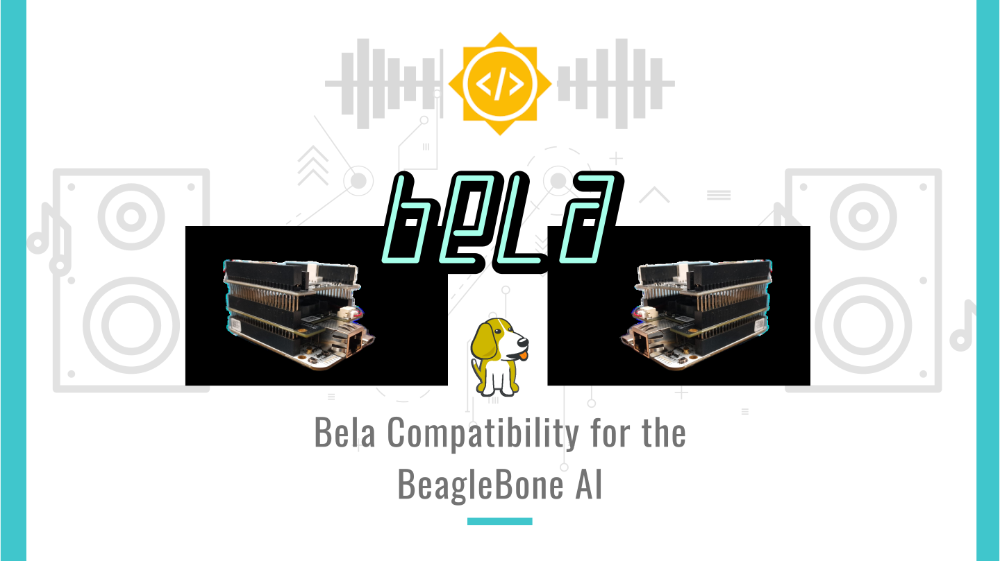

# Bela support for the BBAI

This project proposes to provide restructuring and improvement of existing Bela Software Code to allow for compatibility and easier transition to newer Texas Instrument Sitara Processors (like the AM5729 in the BeagleBone AI).

## About
- _Student Name:_ Dhruva Gole
- _Mentors:_ [Giulio Moro](https://github.com/giuliomoro), Stephen Arnold and Robert Manzke
- _GSoC Entry link:_ [GSoC entry #5697403266531328](https://summerofcode.withgoogle.com/projects/#5697403266531328)
- _Wiki:_ [BB.org forum bela-support-for-bbai](https://forum.beagleboard.org/t/bela-support-for-bbai-later-ti-chips/29257/7)
- _Blog Link:_ [Bela Support for BBAI](https://dhruvag2000.github.io/Blog-GSoC21/)  
This project has been done as part of Google Summer of Code 2021 with the BeagleBoard.org Foundation.  
- _Youtube_: An Introductory video([click here to view](https://www.youtube.com/watch?v=aVLRUyPBBJk)) has been made to explain the project outline. 

## Introduction
As given on the [official website](https://learn.bela.io/get-started-guide/say-hello-to-bela/#what-is-bela), Bela is a hardware and software system for creating beautiful interaction with sensors and sound. 
Bela has a lot of analog and digital inputs and outputs for hooking up sensors and controlling other devices, and most importantly Bela has _stereo audio i/o_  allowing you to interact with the world of sound.  
Both Bela systems use the same Bela software. It uses a customized Debian distribution which - most notably - uses a _Xenomai kernel_ instead of a stock kernel. _Xenomai_ is _co-kernel_ for Linux which allows to achieve hard ___real-time performance___ on Linux machines ([ref: xenomai.org](http://xenomai.org/)). It thus takes advantage of features of the BeagleBone computers and can achieve extremely fast audio and sensor processing times.  
Although the proposal Title mentions support for AI, I will try to develop a standardized setup that allows an easy jump across all TI chips.

**Bela and BB**
 

 
Bela systems have used BeagleBoard computers from the very beginning. Bela uses the BeagleBone Black, and Bela Mini uses the PocketBeagle.

Both the BeagleBone Black, the PocketBeagle, (and also the BBAI) feature **programmable real-time units**, or ___PRUs___, which are central to the way Bela works. These PRUs enable Bela’s ultra-low latency processing: They are fast (200MHz, 32-bit) processors with single-cycle I/O access to a number of the board’s pins, as well as full access to the internal memory and peripherals.

**Applications of Bela:**

Bela is ideal for creating anything interactive that uses sensors and sound. So far, Bela has been used to create:
- musical instruments and audio effects
- kinetic sculptures
- wearable devices
- interactive sound installations
and many more applications that are listed [here](https://learn.bela.io/get-started-guide/say-hello-to-bela/#what-is-bela)

**Why** add support for BBAI/newer TI chips?  

The Beagle Black was launched over 7 years ago in 2013 and newer and better TI Sitara Processors have been launched ever since. It would be better to have a more standardized setup that allows an easier jump across TI chips. Soon, newer boards with different and more efficient chips like the AM5X and the TI C66x digital-signal-processor (DSP) cores in the BBAI are coming up that will need to be compatible with the Bela Software and Hardware.
 
Programming languages and tools to be used:

_C, C++, PRU, dtb, GNU Make, ARM Assembly_

## Achieved Milestones

1. Created a device tree overlay using [Cape Compatibility layer](https://elinux.org/Beagleboard:BeagleBone_cape_interface_spec) to port [BB-BONE-AUDI](https://github.com/beagleboard/bb.org-overlays/blob/master/src/arm/BB-BONE-AUDI-02-00A0.dts) overlay to the BBAI.  
The Overlay I wrote has been accepted by BeagleBone maintainer Robert Nelson, and you can find it to [here](https://github.com/beagleboard/BeagleBoard-DeviceTrees/blob/v4.19.x-ti-overlays/src/arm/overlays/BBAI-AUDI-02-00A0.dts)

2. Created a [BBAI-BELA-00A1 device tree overlay](https://github.com/DhruvaG2000/BeagleBoard-DeviceTrees/blob/v4.19.x-ti-overlays/src/arm/overlays/BBAI-BELA-00A1.dts) which helps in setting the right pinmux for BELA.

3. Adapted to the Bela PRU and ARM code and workflow to use the PRU using the [Remote Processor Framework](https://www.kernel.org/doc/Documentation/remoteproc.txt) and provide backward compatibility to the _almost_ outdated UIO PRUSS depending on the board it is compiled on.
 Associated files:  
	- [PruManager.cpp](https://github.com/DhruvaG2000/Bela/blob/BBAI-support/core/PruManager.cpp)
	- [Prumanager.h](https://github.com/DhruvaG2000/Bela/blob/BBAI-support/include/PruManager.h)

4. Updated the Bela code to use the McASP, GPIO and McSPI on the AM5729 SoC of the BBAI
 Associated Files:  
	- [pru code](https://github.com/DhruvaG2000/Bela/blob/BBAI-support/pru/board_specific.h)

5. Installed a Xenomai patched kernel and ran the full Bela stack.

6. I also ported a debugger for PRU called [PRUDebug](https://github.com/giuliomoro/prudebug/tree/master) to work on both the PRUSS on board the AM5792.
 Associated Files:
	- [prudbg.h](https://github.com/giuliomoro/prudebug/blob/master/prudbg.h)
	- [prudbg.c](https://github.com/giuliomoro/prudebug/blob/master/prudbg.c)

## Pull Requests

1. [beagleboard/BeagleBoard-DeviceTrees BBAI-AUDI-02-00A0 overlay using the CCL #33](https://github.com/beagleboard/BeagleBoard-DeviceTrees/pull/33)

2. [BBAI-AUDI-02-00A0.dts: Solved the output audio frequency issue #36 ](https://github.com/beagleboard/BeagleBoard-DeviceTrees/pull/36)

3. [cloud9-examples Corrected: solved a compilation issue #57 ](https://github.com/beagleboard/cloud9-examples/pull/57)

4. [Bela: PruManager Rproc + MMap/ prussdrv+UIO implementation](https://github.com/giuliomoro/Bela-dhruva/pull/1)

5. [giuliomoro/prudebug: Add support for AM57x #2](https://github.com/giuliomoro/prudebug/pull/2)

6. [MarkAYoder/BeagleBoard-exercises: prudebug: Add BBAI support #7](https://github.com/MarkAYoder/BeagleBoard-exercises/pull/7)

7. [Bela: Add support for BeagleBone AI #668](https://github.com/BelaPlatform/Bela/pull/668)

## Project Shortcomings

Due to the introduction of a new concept called `IRQ_CROSSBAR` for handling interrupts from peripherals in the AM572x chips, porting the existing codes from BELA that use interrupts proved to be a bit complicated. 
After going through the AM572x manual, [a workflow](https://dhruvag2000.github.io/Blog-GSoC21/pru-icss.html#18464-irq_crossbar-module-functional-description) was suggested. However on testing this workflow there still seem to be a few steps missing.

Essentially what we were trying to achieve was McASP --> PRU interrupts like there were in the [pru_rtaudio_irq.p](https://github.com/DhruvaG2000/Bela/blob/BBAI-support/pru/pru_rtaudio_irq.p) code.

Materials referred were: [AM572x sitara manual](https://www.google.com/url?sa=t&rct=j&q=&esrc=s&source=web&cd=&cad=rja&uact=8&ved=2ahUKEwjen9DJ86XyAhVKbn0KHYyaCnwQFnoECAIQAQ&url=https%3A%2F%2Fwww.ti.com%2Flit%2Fug%2Fspruhz6l%2Fspruhz6l.pdf&usg=AOvVaw1H4iD_SzEGYNYlj70bZ9Wk) and
[PRU-ICSS Migration Guide](https://www.google.com/url?sa=t&rct=j&q=&esrc=s&source=web&cd=&cad=rja&uact=8&ved=2ahUKEwjRj-rU86XyAhVbfisKHfQqBskQFnoECAIQAQ&url=http%3A%2F%2Fwww.ti.com%2Flit%2Fan%2Fsprac91%2Fsprac91.pdf&usg=AOvVaw1vtNHcqojXO6uuCUOtYzwp)

**TLDR of shortcomings:**
- Xenomai patched kernel (Linux beaglebone 4.19.94-ti-xenomai-r64) crashes on boot, and the board needs to be reset a couple of times to properly boot.
- The interrupts in AM572x turned out to be much complicated than AM335x due to a new concept called `IRQ_CROSSBARS` which me and the Bela team have been working on for a few days. This may take some more time to implement. (however, this shouldn't be much of a deal-breaker for most users)
- The ARM --> PRU and vice versa interrupts are also yet to be implemented as the driver [rtdm_pruss_irq](https://github.com/BelaPlatform/rtdm_pruss_irq) could not be easily ported by just changing the [BASE ADDRESS](https://github.com/BelaPlatform/rtdm_pruss_irq/blob/master/rtdm_pruss_irq.c#L13)
