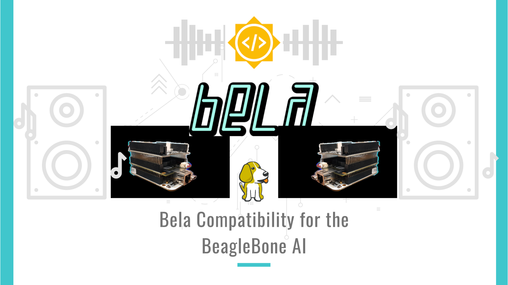

# Bela support for the BBAI

This project proposes to provide restructuring and improvement of existing Bela Software Code to allow for compatibility and easier transition to newer Texas Instrument Sitara Processors (like the AM5729 in the BeagleBone AI).

## About
- _Student Name:_ Dhruva Gole
- _Mentors:_ [Giulio Moro](https://github.com/giuliomoro), Stephen Arnold and Robert Manzke
- _GSoC Entry link:_ [GSoC entry #5697403266531328](https://summerofcode.withgoogle.com/projects/#5697403266531328)
- _Wiki:_ [BB.org forum bela-support-for-bbai](https://forum.beagleboard.org/t/bela-support-for-bbai-later-ti-chips/29257/7)
- _Blog Link:_ [Bela Support for BBAI](https://dhruvag2000.github.io/Blog-GSoC21/)  
This project has been done as part of Google Summer of Code 2021 with the BeagleBoard.org Foundation.  
- _Youtube_: An Introductory video([click here to view](https://www.youtube.com/watch?v=aVLRUyPBBJk)) has been made to explain the project outline. 

## Achieved Milestones

1. Created a device tree overlay using [Cape Compatibility layer](https://elinux.org/Beagleboard:BeagleBone_cape_interface_spec) to port [BB-BONE-AUDI](https://github.com/beagleboard/bb.org-overlays/blob/master/src/arm/BB-BONE-AUDI-02-00A0.dts) overlay to the BBAI.  
The Overlay I wrote has been accepted by BeagleBone maintainer Robert Nelson, and you can find it to [here](https://github.com/beagleboard/BeagleBoard-DeviceTrees/blob/v4.19.x-ti-overlays/src/arm/overlays/BBAI-AUDI-02-00A0.dts)

2. Created a [BBAI-BELA-00A1 device tree overlay](https://github.com/DhruvaG2000/BeagleBoard-DeviceTrees/blob/v4.19.x-ti-overlays/src/arm/overlays/BBAI-BELA-00A1.dts) which helps in setting the right pinmux for BELA.

3. Adapted to the Bela PRU and ARM code and workflow to use the PRU using the [Remote Processor Framework](https://www.kernel.org/doc/Documentation/remoteproc.txt) instead of the _almost_ outdated UIO PRUSS.

4. Updated the Bela code to use the McASP, GPIO and McSPI on the AM5729 SoC of the BBAI

5. Installed a Xenomai patched kernel and ran the full Bela stack.

6. I also ported a debugger for PRU called [PRUDebug](https://github.com/giuliomoro/prudebug/tree/master) to work on both the PRUSS on board the AM5792.

## Pull Requests

1. [beagleboard/BeagleBoard-DeviceTrees BBAI-AUDI-02-00A0 overlay using the CCL #33](https://github.com/beagleboard/BeagleBoard-DeviceTrees/pull/33)

2. [BBAI-AUDI-02-00A0.dts: Solved the output audio frequency issue #36 ](https://github.com/beagleboard/BeagleBoard-DeviceTrees/pull/36)

3. [cloud9-examples Corrected: solved a compilation issue #57 ](https://github.com/beagleboard/cloud9-examples/pull/57)

4. [Bela: PruManager Rproc + MMap/ prussdrv+UIO implementation](https://github.com/giuliomoro/Bela-dhruva/pull/1)

5. [giuliomoro/prudebug: Add support for AM57x #2](https://github.com/giuliomoro/prudebug/pull/2)

6. [MarkAYoder/BeagleBoard-exercises: prudebug: Add BBAI support #7](https://github.com/MarkAYoder/BeagleBoard-exercises/pull/7)

7. [Bela: Add support for BeagleBone AI #668](https://github.com/BelaPlatform/Bela/pull/668)
