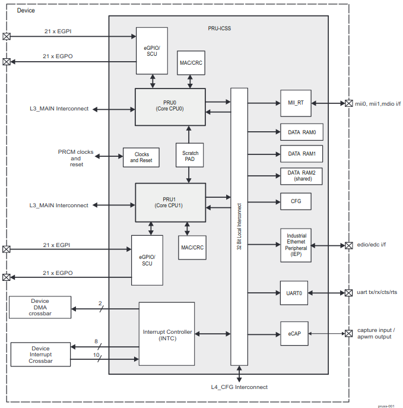

# GSoC2021 Project Report: Bela support for the BBAI

This project proposes to provide restructuring and improvement of existing Bela Software Code to allow for compatibility and easier transition to newer Texas Instrument Sitara Processors (like the AM5729 in the BeagleBone AI).

## About
- _Student Name:_ Dhruva Gole
- _Mentors:_ [Giulio Moro](https://github.com/giuliomoro), Stephen Arnold and Robert Manzke
- _GSoC Entry link:_ [GSoC entry #5697403266531328](https://summerofcode.withgoogle.com/projects/#5697403266531328)
- _Wiki:_ [BB.org forum bela-support-for-bbai](https://forum.beagleboard.org/t/bela-support-for-bbai-later-ti-chips/29257/7)
- _Blog Link:_ [Bela Support for BBAI](https://dhruvag2000.github.io/Blog-GSoC21/)  
This project has been done as part of Google Summer of Code 2021 with the BeagleBoard.org Foundation.  
- _Youtube_:
	- An Introductory video([click here to view](https://www.youtube.com/watch?v=aVLRUyPBBJk)) has been made to explain the project outline. 
	- A small demonstration of the Trill Bar being played with Bela Cape on the BBAI: [click here](https://youtu.be/AiqcA5NhkvM).
- _Bela AI image_: [download belaAI.img.xz from here](https://github.com/DhruvaG2000/Bela/releases/tag/v1.0) to easily get started with Bela on BBAI.

## Introduction
As given on the [official website](https://learn.bela.io/get-started-guide/say-hello-to-bela/#what-is-bela), Bela is a hardware and software system for creating beautiful interaction with sensors and sound. 
Bela has a lot of analog and digital inputs and outputs for hooking up sensors and controlling other devices, and most importantly Bela has _stereo audio i/o_  allowing you to interact with the world of sound.  
All Bela systems so far use the same Bela software. It uses a customized Debian distribution which - most notably - uses a _Xenomai kernel_ instead of a stock kernel. _Xenomai_ is _co-kernel_ for Linux which allows to achieve hard ___real-time performance___ on Linux machines ([ref: xenomai.org](http://xenomai.org/)). It thus takes advantage of features of the BeagleBone computers and can achieve extremely low-latency audio and sensor processing times.  
Although the proposal Title mentions support for AI, I have developed a standardized setup that allows an easy jump across all TI chips.

**Bela and BB**
 

 
Bela systems have used BeagleBoard computers from the very beginning. Bela uses the BeagleBone Black, and Bela Mini uses the PocketBeagle.

Both the BeagleBone Black, the PocketBeagle, (and also the BBAI) feature **programmable real-time units**, or ___PRUs___, which are central to the way Bela works. These PRUs enable Bela’s ultra-low latency processing: They are fast (200MHz, 32-bit) processors with single-cycle I/O access to a number of the board’s pins, as well as full access to the internal memory and peripherals.

**Applications of Bela:**

Bela is ideal for creating anything interactive that uses sensors and sound. So far, Bela has been used to create:
- musical instruments and audio effects
- kinetic sculptures
- wearable devices
- interactive sound installations
and many more applications that are listed [here](https://learn.bela.io/get-started-guide/say-hello-to-bela/#what-is-bela)

**Why** add support for BBAI/newer TI chips?  

The Beagle Black was launched over 7 years ago in 2013 and newer and better TI Sitara Processors have been launched ever since. It would be better to have a more standardized setup that allows an easier jump across TI chips. Soon, newer boards with different and more efficient chips like the AM5X and the TI C66x digital-signal-processor (DSP) cores in the BBAI are coming up that will need to be compatible with the Bela Software and Hardware.
 
Programming languages and tools to be used:

_C, C++, PRU, dtb, GNU Make, ARM Assembly_

## Implementation Details
The hardware was partially working on the BBAI using only ALSA([Advanced Linux Sound Architecture](https://en.wikipedia.org/wiki/Advanced_Linux_Sound_Architecture)) and the SPI driver [(refer)](https://github.com/giuliomoro/beaglebone-ai-bela). However, the Bela real-time code on ARM and PRU was not running on the BBAI yet. 
This project involved dealing with pinmuxing (using overlays), PRU assembly, C and C++ for Linux user space applications and I also had to study the Technical Reference Manual of the Sitara family of SoCs. ([AM5729](https://www.ti.com/lit/ug/spruhz6l/spruhz6l.pdf)  and the AM335x).

### Background

**What is RProc?**  
The remoteproc framework allows different platforms/architectures to
control (power on, load firmware, power off) those remote processors while
abstracting the hardware differences, so the entire driver doesn't need to be
duplicated. In addition, this framework also adds rpmsg virtio devices
for remote processors that supports this kind of communication. This way,
platform-specific remoteproc drivers only need to provide a few low-level
handlers  
Reference: [kernel.org](https://www.kernel.org/doc/Documentation/remoteproc.txt)

**What is a Device Tree Overlay?**
Sometimes it is not convenient to describe an entire system with a
single FDT(Flattened Device Tree). For example, processor modules that are plugged into one or
more modules (a la the BeagleBone), or systems with an FPGA peripheral
that is programmed after the system is booted.
For these cases it is proposed to implement an overlay feature
so that the initial device tree data can be modified by userspace at
runtime by loading additional device tree overlays that amend the original data.

**Pinmuxing**
The following pin diagram  
   from a mathworks forum aided greatly to help visualize and compare the pins on the BeagleBone black versus the BeagleBone AI.  
Also, inorder to write a DTO(Device Tree Overlay) using CCL([Cape Compatibility Layer](https://deepaklorkhatri.me/GSoC2020_BeagleBoard.org/)), I referred [am572x-bone-common-univ.dtsi](https://github.com/DhruvaG2000/BeagleBoard-DeviceTrees/blob/v4.19.x-ti-overlays/src/arm/am572x-bone-common-univ.dtsi) which helps one understand the names and references to the pinmuxes.

**How is an overlay compiled?** 
`dtc`(Device Tree Compiler) - converts between the human editable device tree source `dts` format and the compact device tree blob `dtb` representation usable by the kernel or assembler source.   Once an overlay is compiled, it generates a `.dtbo` file which we can then use in the next stage to load the overlay.  
To know more on how to compile and load the overlay, just head over to [overlay-instructions](https://dhruvag2000.github.io/Blog-GSoC21/Bela/overlay-instructions.html).

**XENOMAI kernel** 
Xenomai is a Free Software project in which engineers from a wide background collaborate to build a robust and resource-efficient real-time core for Linux© following the dual kernel approach, for applications with stringent latency requirements.

Xenomai kernel (`v4.19.94-ti-xenomai-r64`) has been built and tested on the BBAI with a few minor bugs. I have installed the xenomai kernel through the default procedure to update kernel and libraries which I have documented [here](https://dhruvag2000.github.io/Blog-GSoC21/xenomai/install.html). I have successfully built the entire Bela core code without needing to modify any xenomai dependant syntax.

**Hardware used** 
Hardware required:
The hardware listed below was used for testing if my code implementation works correctly.
1. BeagleBone AI.
2. Bela cape: [The original Bela board](https://shop.bela.io/bela).
3. LA104 Logic Analyzer (helped me to debug McASP clock)
4. LEDs, jumper wires, Multimeter, etc.
5. A Fan Cape

### Details of Implementation

The places within the Bela core code that required intervention are: 
#### The [**Makefile:**](https://github.com/giuliomoro/Bela-dhruva/blob/BBAI-support/Makefile#L297)
Addition of `IS_AM572x` flag that is set automatically `1` on the BBAI and not set in BBB.
Updated the workflow to build the PRU code for remoteproc. Also implemented auto-detection of which processor the code was being compiled on which was passed as a compile time flag to the BELA PRU and Core codes.  
New flags and their brief description: 

| Flag Name 	| Values 	| Description 	|
|---	|---	|---	|
| `IS_AM572x` 	| 1 and 0	| - Set as 1 on BBAI   - Set as 0 on BBB|
| `ENABLE_PRU_UIO` 	| 1 and 0 	| Tells `PruManager` to use the UIO+`libprussdrv` implementation   - Set 0 on BBAI.   - Set 1 on BBB 	|
| `ENABLE_PRU_RPROC` 	| 1 and 0 	| Tell `PruManager` to use the `RProc+Mmap` implementation  - Set 1 on BBAI.   - Set 0 on BBB 	|
| `BOARD_COMMON_FLAGS` 	| `-DIS_AM572x` 	| Only gets set on BBAI 	|
| `firmwareBelaRProcNoMcaspxxxx` 	| `build/pru/pru_rtaudio.out` 	| useful mainly with RProc for passing `.out` file path of ___non___ McASP IRQ PRU code to `PruManager`	|
| `firmwareBelaRProcMcaspxxxx` 	| `build/pru/pru_rtaudio_irq.out` 	| useful mainly with RProc for passing `.out` file path of _McASP IRQ PRU_ code to `PruManager`	|

**Workflow to build pasm code** 

Although pasm is outdated, the binary it generates is still valid for the PRU. The issue is with the fact that it does not generate a file ready to be packaged up as a valid `.out` ELF which remoteproc would recognise and load as fw into the PRU. To solve this issue, we came up with the following workflow to build the PRU Firmware to be used by RProc:
- Build the asm code normally using `pasm -V2 -L -c -b`.
- Use the disassembler Giulio Moro put together hacking the one that was inside prudebug. (Find it [here](https://github.com/giuliomoro/prudebug/tree/disassembler). (Note: A disassembler is a computer program that translates machine language into assembly language).  
	Process the bin through the disassembler and make it ready to be included in `resources/rproc-build/rproc-template.c` as an `__asm__` directive (i.e.: add quotes and prepend a space at the beginning of each line): 
	`prudis $< | sed 's/^\(.*\)$$/" \1\\n"/' > $(RPROC_INCLUDED_ASSEMBLY)`
- build the `.c` file mentioned above with the regular clpru toolchain.  
	`clpru -fe $(RPROC_TMP_FILE).o $(RPROC_TEMPLATE) -v3 --endian=little --include_path=$(RPROC_BUILD_DIR) --include_path=$(RPROC_INCLUDE) --include_path=/usr/lib/ti/pru-software-support-package/include`
- link the programs using `lnkpru -o $(RPROC_TMP_FILE).out $(RPROC_TMP_FILE).o --stack_size=0x0 --heap_size=0x0 -m $(RPROC_TMP_FILE).map $(RPROC_CMD)`
- clpru seems to meddle with the `QBA`/`QBBx` instructions in there, so in the `dd` step 
	`dd if=$< of=$(RPROC_TMP_FILE).out bs=1 obs=1 seek=52 conv=notrunc status=none`  
	we actually replace all the code generated by clpru with the original `.bin` that had been created by `pasm`.

#### Developed [PruManager code](https://github.com/giuliomoro/Bela-dhruva/blob/BBAI-support/core/PruManager.cpp)
PruManager enables RProc and UIO PRUSS(using the libprussdrv API) implementation all under one roof.

**Transitioning from libprussdrv to rproc:**

I initially believed that I needed to change the initialization code in [PRU.cpp](https://github.com/BelaPlatform/Bela/blob/master/core/PRU.cpp#L18) that is currently relying on `libprussdrv` and move to using `rproc`. I was not sure if rproc provides some functionalities to access the PRU's RAM the way `prussdrv_map_prumem()` used to, that essentially gives access to a previously mmap'ed area of memory.  
On the latest Bela code there's a `Mmap` class which can make this somehow simpler ([ref. here](http://docs.bela.io/classMmap.html)).  
For this transition, maintaining backward compatibility was also quite essential. This is what the `PruManager` class achieves. Below is a rough structure of the [class `PruManager`:](https://github.com/giuliomoro/Bela-dhruva/blob/BBAI-support/include/PruManager.h) 
- `class PruManager` is an abstract base class  **Protected variables:** [see here](https://github.com/giuliomoro/Bela-dhruva/blob/BBAI-support/include/PruManager.h#L23-L26)  **functions:** 
- `void stop();` as the name suggests, stops the PRU
- `int start(bool useMcaspIrq);` The first start is called by the `PRU.cpp` code where required, where `useMcaspIrq` is a flag that decides which pru code is to be used out of `pru_rtaudio.p` and `pru_rtaudio_irq.p`.
- `int start(const std::string& path);` The second start is called within the first one after the choice of PRU code is made. This function then does the job of loading the firmware file and starting the PRU.
- `void* getOwnMemory();` Each PRU has is own 8-KiB data RAM per PRU CPU (signified RAM0 for PRU0 and RAM1 for PRU1) and 32-KiB general purpose memory RAM (signified RAM2) shared between PRU0 and PRU1. (ref. [prucookbook](https://beagleboard.org/static/prucookbook/#_memory_allocation))
- `void* getSharedMemory();` refer the DATA RAM2 (shared) block in the diagram below from the AM572x Ref. Manual These last 2 functions are responsible for accessing the data memory and shared memory respectively. 

The classes below are children of the above `PruManager` virtual base class.
- `class PruManagerRprocMmap` is responsible for RProc implementation.
The RProc Mmap class is named so, because we are also using the `Mmap.h` header mentioned above to access `/dev/mem` on the BeagleBones to read or write to desired global memory locations. 
This class is currently being used only on the AM572x processor (_ie. the BBAI_).
- The constructor of this class sets the path variables and depending on the device it is being compiled on, sets the `prussAddresses` which is a vector of type `<uint32_t>` and is responsible for keeping the base addresses of the 2 PRU Sub Systems.
- The `getOwnMemory()` then accesses the DATA RAM using an object of `class Mmap` called `ownMemory`:  `ownMemory.map(prussAddresses[pruss - 1] + prussOwnRamOffsets[pruCore], 0x2000);`  The `map()` takes the parameters _offset_ and _size_ of the memory to be accessed. The `dataram0` and `1` (shown in the PRU-ICSS  block diagram) is `8-KiB` and hence the second parameter is set as `0x2000`.
- The `getSharedMemory` function then accesses the shared RAM using an object of `class Mmap` called `sharedMemory`:  `sharedMemory.map(prussAddresses[pruss - 1] + prussSharedRamOffset, 0x8000);`  The general purpose memory RAM (signified RAM2) shared between PRU0 and PRU1 is `32-KiB` hence here it's `0x8000`.
- `class PruManagerUio` is basically a ditto implementation of the `libprussdrv` approach that was being used earlier. This class is mainly useful to maintain backward compatibility with v4.14 on the BBB+Bela. It _does not_ support the AM572x processor.
- The Makefile passes the flags `ENABLE_PRU_RPROC` which tells the core/codes to use the RProc implementation _or else_ `ENABLE_PRU_UIO` tells the core/codes to keep using the old `libprussdrv` implementation.

3. **PRU Codes:** In `pru/pru_rtaudio.p` the hard-coded McASP, SPI and GPIO constants were replaced with board-dependent ones using `board_specific.h`. 
`pru/board_specific.h` uses the `IS_AM572x` to set the proper BASE constants depending on which board it is compiling on. The GPIO, `CLOCK_MCASP1`, MCASP1, `CLOCK_SPI2`, SPI2, and a few other Base Addresses needed changing in the AM572x. For more details [visit my PR](https://github.com/BelaPlatform/Bela/pull/669/files).

4. Other places like `Gpio.cpp`, `bela_hw_settings.h`, and a few other codes also needed updating the base addresses for including the new AM572x constants. Those changes can also be viewed all at once [here](https://github.com/BelaPlatform/Bela/pull/669/files).
 

2 device tree overlays were also created using the CCL, 
1. [BBAI-AUDI-02-00A0:](https://github.com/beagleboard/BeagleBoard-DeviceTrees/blob/v4.19.x-ti-overlays/src/arm/overlays/BBAI-AUDI-02-00A0.dts) which essentially helps ALSA detect the BELA Cape as an audio device and you can play audio files with it using the command `aplay`.
2. [BBAI-BELA-00A1.dts:](https://github.com/DhruvaG2000/BeagleBoard-DeviceTrees/blob/v4.19.x-ti-overlays/src/arm/overlays/BBAI-BELA-00A1.dts) It helps set the right pinmux for the I2C, SPI, GPIO, etc. for them all to work correctly.
 

and, a debugger for PRU called [PRUDebug](https://github.com/giuliomoro/prudebug/tree/master) was ported to the BBAI.

## Achieved Milestones

1. Created a device tree overlay using [Cape Compatibility layer](https://elinux.org/Beagleboard:BeagleBone_cape_interface_spec) to port [BB-BONE-AUDI](https://github.com/beagleboard/bb.org-overlays/blob/master/src/arm/BB-BONE-AUDI-02-00A0.dts) overlay to the BBAI.  
The Overlay I wrote has been accepted by BeagleBone maintainer Robert Nelson, and you can find it to [here](https://github.com/beagleboard/BeagleBoard-DeviceTrees/blob/v4.19.x-ti-overlays/src/arm/overlays/BBAI-AUDI-02-00A0.dts)

2. Created a [BBAI-BELA-00A1 device tree overlay](https://github.com/DhruvaG2000/BeagleBoard-DeviceTrees/blob/v4.19.x-ti-overlays/src/arm/overlays/BBAI-BELA-00A1.dts) which helps in setting the right pinmux for BELA.

3. Adapted to the Bela PRU and ARM code and workflow to use the PRU using the [Remote Processor Framework](https://www.kernel.org/doc/Documentation/remoteproc.txt) and provide backward compatibility to the _almost_ outdated UIO PRUSS depending on the board it is compiled on.
 Associated files:  
	- [PruManager.cpp](https://github.com/DhruvaG2000/Bela/blob/BBAI-support/core/PruManager.cpp)
	- [Prumanager.h](https://github.com/DhruvaG2000/Bela/blob/BBAI-support/include/PruManager.h)

4. Updated the Bela code to use the McASP, GPIO and McSPI on the AM5729 SoC of the BBAI
 Associated Files:  
	- [pru code](https://github.com/DhruvaG2000/Bela/blob/BBAI-support/pru/board_specific.h)

5. Installed a Xenomai patched kernel and ran the full Bela stack.

6. I also ported a debugger for PRU called [PRUDebug](https://github.com/giuliomoro/prudebug/tree/master) to work on both the PRUSS on board the AM5792.
 Associated Files:
	- [prudbg.h](https://github.com/giuliomoro/prudebug/blob/master/prudbg.h)
	- [prudbg.c](https://github.com/giuliomoro/prudebug/blob/master/prudbg.c)

## Pull Requests

1. [beagleboard/BeagleBoard-DeviceTrees BBAI-AUDI-02-00A0 overlay using the CCL #33](https://github.com/beagleboard/BeagleBoard-DeviceTrees/pull/33)

2. [BBAI-AUDI-02-00A0.dts: Solved the output audio frequency issue #36 ](https://github.com/beagleboard/BeagleBoard-DeviceTrees/pull/36)

3. [cloud9-examples Corrected: solved a compilation issue #57 ](https://github.com/beagleboard/cloud9-examples/pull/57)

4. [Bela: PruManager Rproc + MMap/ prussdrv+UIO implementation](https://github.com/giuliomoro/Bela-dhruva/pull/1)

5. [giuliomoro/prudebug: Add support for AM57x #2](https://github.com/giuliomoro/prudebug/pull/2)

6. [MarkAYoder/BeagleBoard-exercises: prudebug: Add BBAI support #7](https://github.com/MarkAYoder/BeagleBoard-exercises/pull/7)

7. [Bela: Add support for BeagleBone AI #668](https://github.com/BelaPlatform/Bela/pull/668)

## Project Shortcomings

Due to the introduction of a new concept called `IRQ_CROSSBAR` for handling interrupts from peripherals in the AM572x chips, porting the existing codes from BELA that use interrupts proved to be a bit complicated. 
After going through the AM572x manual, [a workflow](https://dhruvag2000.github.io/Blog-GSoC21/pru-icss.html#18464-irq_crossbar-module-functional-description) was suggested. However on testing this workflow there still seem to be a few steps missing.

Essentially what we were trying to achieve was McASP --> PRU interrupts like there were in the [pru_rtaudio_irq.p](https://github.com/DhruvaG2000/Bela/blob/BBAI-support/pru/pru_rtaudio_irq.p) code.

Materials referred were: [AM572x sitara manual](https://www.google.com/url?sa=t&rct=j&q=&esrc=s&source=web&cd=&cad=rja&uact=8&ved=2ahUKEwjen9DJ86XyAhVKbn0KHYyaCnwQFnoECAIQAQ&url=https%3A%2F%2Fwww.ti.com%2Flit%2Fug%2Fspruhz6l%2Fspruhz6l.pdf&usg=AOvVaw1H4iD_SzEGYNYlj70bZ9Wk) and
[PRU-ICSS Migration Guide](https://www.google.com/url?sa=t&rct=j&q=&esrc=s&source=web&cd=&cad=rja&uact=8&ved=2ahUKEwjRj-rU86XyAhVbfisKHfQqBskQFnoECAIQAQ&url=http%3A%2F%2Fwww.ti.com%2Flit%2Fan%2Fsprac91%2Fsprac91.pdf&usg=AOvVaw1vtNHcqojXO6uuCUOtYzwp)

**TLDR of shortcomings:**
- Xenomai patched kernel (Linux beaglebone 4.19.94-ti-xenomai-r64) crashes on boot, and the board needs to be reset a couple of times to properly boot.
- The interrupts in AM572x turned out to be much complicated than AM335x due to a new concept called `IRQ_CROSSBARS` which me and the Bela team have been working on for a few days. This may take some more time to implement. (however, this shouldn't be much of a deal-breaker for most users)
- The PRU --> ARM interrupts are also yet to be implemented as the driver [rtdm_pruss_irq](https://github.com/BelaPlatform/rtdm_pruss_irq) could not be easily ported by just changing the [BASE ADDRESS](https://github.com/BelaPlatform/rtdm_pruss_irq/blob/master/rtdm_pruss_irq.c#L13)

## Benefit

This project adds support for the Bela cape + Xenomai + PRU on the BeagleBone AI, and also the code will now be easier to port to other Texas Instruments systems-on-chips.

> By going through the steps needed to have the Bela environment running on BBAI, we will go through refactoring and rationalization, using mainline drivers and APIs where possible. This will make Bela easier to maintain and to port to new platforms, benefiting the project's longevity and allowing it to expand its user base.

-Giulio Moro

> Just ordered a Bela cape. The platform seems really cool and exactly what I was looking for :) Just thought I would add that, I would also be very interested in having a bit more processing power under the hood and the ai would definitely be enough for my purposes.

- A User on Bela Forum

## References

1. [BBAI System-Reference-Manual](https://github.com/beagleboard/beaglebone-ai/wiki/System-Reference-Manual)
2. [AM572x Sitara Processor Technical Reference Manual (Rev. L)](https://www.ti.com/lit/ug/spruhz6l/spruhz6l.pdf)
3. [AM335x and AMIC110 Sitara™ Processors Technical Reference Manual](https://www.ti.com/lit/ug/spruh73q/spruh73q.pdf)
4. [BB.org forum](https://forum.beagleboard.org/t/bela-support-for-bbai-later-ti-chips/29257)
5. [kernel.org/remoteproce](https://www.kernel.org/doc/html/latest/staging/remoteproc.html)
6. [Xenomai Wiki](https://source.denx.de/Xenomai/xenomai/-/wikis/Installing_Xenomai_3#library-install)
7. [GNU Make Manual](https://www.gnu.org/software/make/manual/make.html)
