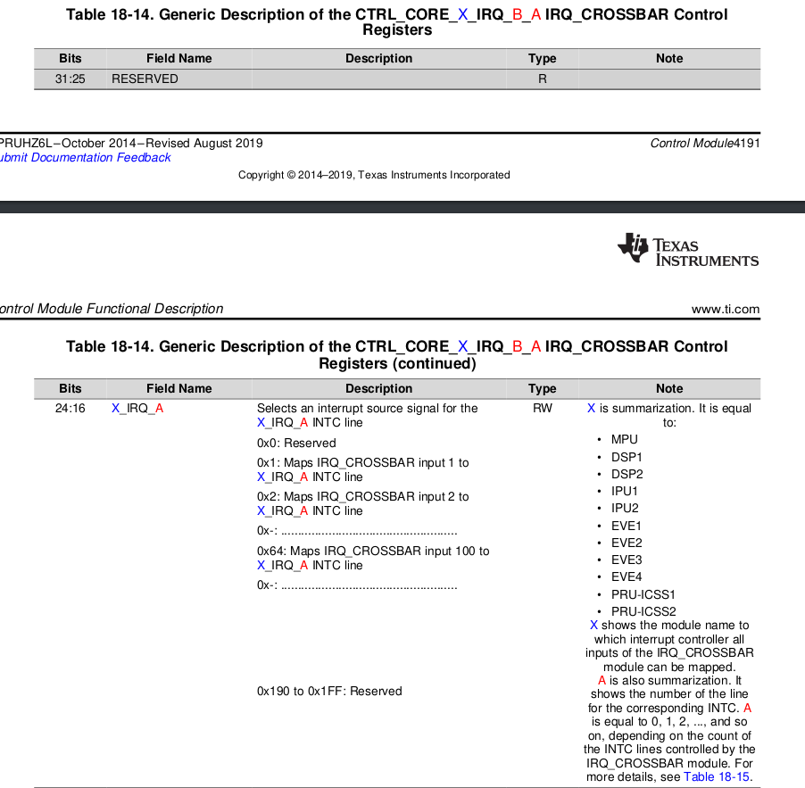
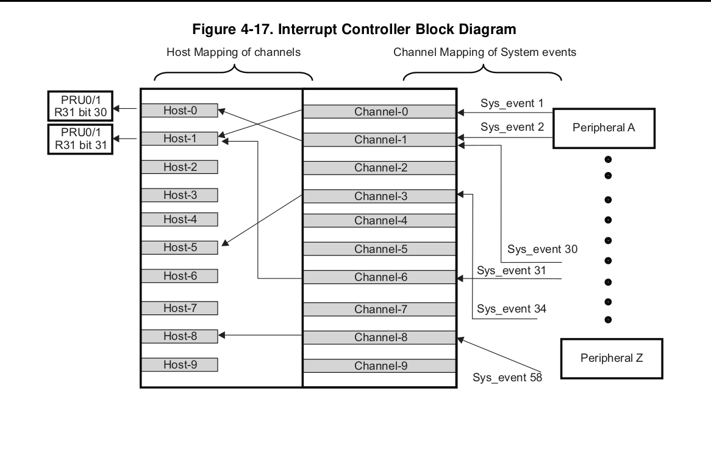
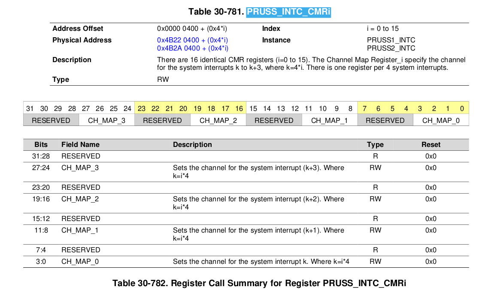
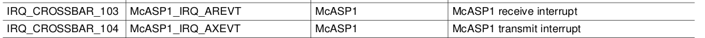

# PRU Interrupt Study

## Aim
How does one route a McASP Rx/Tx IRQ to the PRU via the CROSSBAR? Is this supported by any existing driver?

## 18.4.6.4 `IRQ_CROSSBAR` Module Functional Description

There are IRQs which are not mapped by default to any interrupt line of any device INTC. All IRQs, connected to the `IRQ_CROSSBAR` inputs, can be remapped to other interrupt lines of the different device INTCs through the `CTRL_CORE_X_IRQ_B_A` registers. Each of these registers has a structure described in Table 18-14.

(source pg 4195 of TRM AM57x)
The individual connection between all module IRQs and all `IRQ_CROSSBAR` inputs is shown in _Section 17.3.12_ (**Which we have already observed and the image is pasted down below, where we can see corssbar --> MCASP**), Mapping of Device Interrupts to `IRQ_CROSSBAR` Inputs of _Chapter 17_, Interrupt Controllers.  
In addition, the `CTRL_CORE_OVS_IRQ_IO_MUX` register is used to select for observation on two external pads any IRQ connected to the `IRQ_CROSSBAR` inputs. Using the `CTRL_CORE_OVS_IRQ_IO_MUX[17:9]` `OVS_IRQ_IO_MUX_2` bit field all IRQs can be mapped to the  `obs_irq2` signal. The `CTRL_CORE_OVS_IRQ_IO_MUX[8:0] OVS_IRQ_IO_MUX_1` bit field maps all IRQs to the `obs_irq1` signal. For example, setting the `CTRL_CORE_OVS_IRQ_IO_MUX[8:0] OVS_IRQ_IO_MUX_1 to 0x18` maps the `GPIO1_IRQ_1 to the obs_irq1` line and thus this IRQ can be observed.

So, infering from what has been said above, we will try to do the following:

- We know, that `CTRL_CORE_OVS_IRQ_IO_MUX` is at `0x4A00 2D50` location.
- It has `OVS_IRQ_IO_MUX_1` at bits _8:0_   and `2` at bits _17:9_ .
- McASP rx is `IRQ_CROSSBAR_103` which is in hex `0x67`   and MCASP tx is `IRQ_CROSSBAR_104` ie. `0x68`.
- for testing purposes, we can use the `devmem2` tool to try and set these in the required bits. (**note:** a word is 16 bits). Once that's done we expect to to have the bit fields mapped to `obs_irq1` and `obs_irq2` respectively.
- after these bits are set, we can make use of the `CTRL_CORE_X_IRQ_B_A` registers, specifically `CTRL_CORE_PRUSS1_IRQ_38_39` and set the bits _8:0_ ie. `PRUSS1_IRQ_38` and _24:16_ ie. `PRUSS1_IRQ_39` to `0x67` and `0x68` respectively.
- once this is done, we have a look at
> The MII_RT Event Enable Register enables MII_RT mode events to the PRUSS.PRUSS_INTC.

ie. the `PRUSS_MII_RT` register at address `0x4B22 602C`. (**Note** set the `MII_RT_EVENT_EN`=0b1) to have `PRU-ICSS MII_RT` module associated events, mapped to the same lines.

- In our case, these will be `PRUSS1_IRQ_39` and `38` _IRQ input lines_.

- Now, referring to

> The channel map registers (PRUSS_INTC_CMRi, where i=0 to 15) define the channel for each system interrupt.

and to understand system interrupt, referring to

> Enable required system interrupts: System interrupts that are required to get propagated to host are to be enabled individually by writing to INDEX field in the system interrupt enable indexed set register (`PRUSS_INTC_EISR`). The interrupt to enable is the index value written. This sets the Enable Register bit of the given index.

which means that we need to write `0x26` and `0x27` to `0x4B22 0028` inorder to enable those two interrupts one by one.

- It is pobably worth reading the "The next stage is to capture which system interrupts are pending." part, which I am not sure, but think it has been done already in the BELA Pru irq code.

- Now, we come to `PRUSS_INTC_CMRi` registers located at `0x4B22N 0400 + 0X4*i`, where i in our case will be channel i=1.  
So, we want the system interrupt `0x26 and 27` to be mapped to channel 1 which when divided by 4 means that we write the value of k as `0x9` to the bits `11:8` ie. `CH_MAP_1`.

- Now that we have mapped the right McASP interrupts to channel 1, which is what the existing BELA PRU IRQ Code checks for already, I think so that the above described workflow should be enough.

## PRU-ICSS Interrupt Controller Overview 

The PRU-ICSS interrupt controller (`PRUSS_INTC`) maps interrupts coming from different parts of the device (mapped to PRU-ICSS1/PRU-ICSS2 via the device `IRQ_CROSSBAR`) to a reduced set of PRU-ICSS interrupt channels.
The `PRUSS_INTC` has the following features:
- Capturing up to 64 System Events (inputs).
- Supports up to 10 output interrupt channels.
- Generation of 10 Host Interrupts.
- 2 Host Interrupts for the PRUs
- 8 Host Interrupts exported from the PRU-ICSS for signaling the ARMSS interrupt controllers.

## Functional description
**30.1.6.2 PRU-ICSS Interrupt Controller Functional Description**
The PRU-ICSS incorporates an interrupt controller - `PRUSS_INTC` that supports up to _64_ system interrupts from different peripherals (including 32 interrupts from PRU-ICSS located interrupt sources). The `PRUSS_INTC` maps these system events to _10 channels inside_ the `PRUSS_INTC` (see Figure).  
Interrupts from these 10 channels are further mapped to 10 Host Interrupts.

- Any of the 64 system interrupts can be mapped to any of the 10 channels.
- Multiple interrupts can be mapped to a single channel.
- An interrupt should not be mapped to more than one channel.
- Any of the 10 channels can be mapped to any of the 10 host interrupts. It is recommended to map
channel “x” to host interrupt “x”, where x is from 0 to 9
- A channel should not be mapped to more than one host interrupt
- For channels mapping to the same host interrupt, lower number channels have higher priority.
- For interrupts on same channel, priority is determined by the hardware interrupt number. The lower the
interrupt number, the higher the priority.
- Host Interrupt 0 is connected to bit 30 in register 31 (R31) of PRU0 and PRU1.
- Host Interrupt 1 is connected to bit 31 in register 31 (R31) for PRU0 and PRU1.
- Host Interrupts 2 through 9 exported from PRU-ICSS and mapped to interrupt controllers in the device.

## 30.1.6.2.2.1.1 PRU-ICSS Interrupt Enabling
The next stage of `PRUSS_INTC` is to enable system interrupts based on programmed settings. The
following sequence is to be followed to enable interrupts:
- Enable required system interrupts: The System Interrupt Enable Indexed Set Register allows enabling an interrupt. The interrupt to enable is the index value written. This sets the Enable Register bit of the given index.
 
Physical Address:  

0x4B22 0028 | `PRUSS1_INTC`  
0x4B2A 0028 | `PRUSS2_INTC`  

**Table 30-741. PRUSS1_INTC Registers Mapping Summary**

0x4B22 0284 | `PRUSS1_INTC Base addr`  
0x4B2A 0284 | `PRUSS2_INTC`  

**Table 30-771. `PRUSS_INTC_SECR1`** talks in detail about the same.

- Enable required host interrupts: By writing 1 to the appropriate bit of the INDEX field in the host
interrupt enable indexed set register (`PRUSS_INTC_HIEISR`), enable the required host interrupts. The
host interrupt to enable is the index value written. This enables the host interrupt output or triggers the
output again if that host interrupt is already enabled.
*ref. Table 30-231. PRUSS_INTC_HIEISR*
 
Physical Address: 

0x4B22 0034 | `PRUSS1_INTC`  
0x4B2A 0034 | `PRUSS2_INTC`  

- Enable all host interrupts: By setting the ENABLE bit in the global enable register (`PRUSS_INTC_GER`) to 1, all host interrupts will be enabled. Individual host interrupts are still _enabled_ or _disabled_ from their individual enables and are not overridden by the global enable. (we probably do not need this)

*Note:* Checkout _30.2.6.2.2.2 PRU-ICSS Interrupt Status Checking_ of AM57xx Manual, just to be sure that the BELA PRU code is using the right register locations to check the interrupt statuses.

## 30.2.6.3 PRU-ICSS Interrupt Controller Basic Programming Model
Follow these steps to configure the interrupt controller.
 
- Set polarity and type of system event through the System Interrupt Polarity Registers (`PRUSS_INTC_SIPR1` and `PRUSS_INTC_SIPR0`) and the System Interrupt Type Registers (`PRUSS_INTC_SITR1` and `PRUSS_INTC_SITR0`). Polarity of all system interrupts is always high. Type of all system interrupts is always pulse.

- Map system event to `PRUSS_INTC` channel through `PRUSS_INTC_CMRi` (_i=0 to 15_) channel mapping registers.
- Map channel to host interrupt through `PRUSS_INTC_HMR0/1/2` registers. Recommended channel “x” to be mapped to host interrupt “x”.
- Clear system interrupt by writing _1_ to `PRUSS_INTC_SECR0/1` registers.
- Enable host interrupt by writing index value to `PRUSS_INTC_HIEISR` register.
- Enable interrupt nesting if desired.
- Globally enable all interrupts through register `PRUSS_INTC_GER[0] ENABLE_HINT_ANY` bit.

## Routing McASP0 interrupts to PRU INTC
Let's take `PRUSS_INTC_CMR0 and 1`. As per _Table 30-781_ `PRUSS_INTC_CMRi` the physical addresses will be:
 
0x4B22 0400 + 0 --> for `...CMR_0`  
0x4B2A 0400 + 4 = 0x4B2A0404 --> `...CMR_1`  
and then we have to set the bits according to this table:

Here, we will set the bits 3:0 ie. `CH_MAP_0` 

pg 6076:
> `MCASPi_IRQ_AREVT` can be also generated if the `RDATA` interrupt is enabled in the `MCASP_EVTCTLR` register (for details, see Section 24.6.4.12.1, Receive Data Ready Interrupt).

*From table 17-11. PRUSS1_INTC Default Interrupt Mapping (continued)*
Let's use the `PRUSS1_IRQ_38` which is `Reserved by default but can be remapped to a
valid interrupt source` and also `PRUSS1_IRQ_39`. From pg 43821 Table 18-553,
 
*Addr offset:* `0x0000 08D4`
*Physical Address:* `0x4A00 28D4`

## PRUSSDRV to RPROC
- The basic unit of communication between remoteproc and the PRU as of now is
using *downcalls* and *syscalls*.

- A *syscall* is when the PRU raises an IRQ and halts itself, storing some
values in its registers. The kernel module handles the syscall IRQ, it
reads the registers, manipulates them and resumes the PRU over the HALT
instruction. [See here](https://github.com/abhishek-kakkar/BeagleLogic/blob/master/beaglelogic-firmware/pru_syscalls.asm) for an example code of the syscall on the PRU side.

- A *downcall* is initiated by the kernel module. Think of it as calling a
function in the PRU from the kernel module and receiving the return value
back in the kernel module.  
*Note:* The PRU has to be polling for the downcall, and it acknowledges with a
special syscall. Then the function `handle_downcall` is called, which
receives the downcall value and the parameters. So the `handle_downcall`
[example](https://github.com/abhishek-kakkar/BeagleLogic/blob/master/beaglelogic-firmware/beaglelogic-pru0.c#L106) is a switch-case thing where the PRU does something and once it returns
from this function, there is a syscall triggered which signals that the
downcall is complete, the kernel module reads the return value of the
function, after which the downcalling function in the kernel module returns
with the return value.

- the crux is that remoteproc currently is very application-specific and you have to twist and adapt the
kernel module to your needs. Once the remoteproc stuff gets finalized,
ideally there would be a generic framework and userspace layer on top of
the driver to allow you to write your own applications from userspace, in a
similar way as it is currently done using libprussdrv.

## Common Terms used 
- *PRU-ICSS:* Programmable Real-Time Unit Subsystem and Industrial Communication Subsystem.
- *Arm interrupts:* [Refer this tutorial](https://www.electronicshub.org/arm-interrupt-tutorial/)

## References
1. [TI Forum: am3359-routing-mcasp0-interrupts-to-pru-intc](https://e2e.ti.com/support/processors-group/processors/f/processors-forum/598002/am3359-routing-mcasp0-interrupts-to-pru-intc)
2. [TI-forum: gpio crossbar settings](https://e2e.ti.com/support/processors-group/processors/f/processors-forum/504356/notify-overwrites-gpio-crossbar-setting)
3. [mail-archive: Using irq-crossbar.c](https://www.mail-archive.com/search?l=linux-kernel@vger.kernel.org&q=subject:%22Re%5C%3A+Using+irq%5C-crossbar.c%22&o=newest&f=1)
4. [TI Forum: am572x-interrupt-mapping-for-dsp-and-gmac](https://e2e.ti.com/support/legacy_forums/embedded/tirtos/f/ti-rtos-forum-read-only-archived/485801/am572x-interrupt-mapping-for-dsp-and-gmac)
5. [TI:hwi-event-mapping](https://e2e.ti.com/support/processors-group/processors/f/processors-forum/146033/hwi-event-mapping)
6. [BB-archive:prussdrv-to-remoteproc](https://beagleboard.narkive.com/rBJOnq8h/prussdrv-to-remoteproc)

## Misc.

pg4163

CTRL_CORE_PRUSS1_IRQ_32_33 RW 32 0x0000 08C8 0x4A00 28C8
